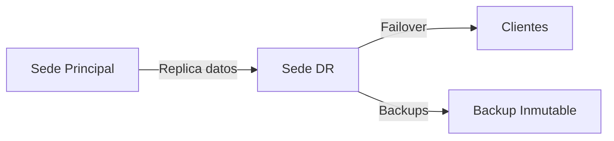

# 🛟 DR — Disaster Recovery
## Guía ejecutiva para la plataforma ISP + Hosting

---

## 📌 ¿Qué es DR?

**DR (Disaster Recovery)** = Plan y conjunto de sistemas que permiten **recuperar la operación** después de un desastre grave:

- apagón prolongado
- incendio
- inundación
- fallo total de hardware
- ransomware
- pérdida del sitio principal

DR es el **plan B** del negocio.

---

## 🧭 Diferencia entre Backup y DR

| Backup | DR |
|------|----|
Guarda datos | Recupera el negocio |
Se centra en archivos | Se centra en servicios |
Puede tardar horas/días | Debe cumplir RTO |
No mantiene operación | Restablece operación completa |

---

## 🧱 Componentes de un DR real

---

## 🕒 DR, RTO y RPO

- **RTO**: cuánto tiempo puede estar caído el servicio  
- **RPO**: cuántos datos se pueden perder  
- **DR**: infraestructura y procesos que permiten cumplirlos

---

## 🧩 Ejemplo práctico

Si:
- RTO = 30 minutos
- RPO = 15 minutos

Entonces el DR debe tener:
- datos replicados cada ≤ 15 min
- infraestructura que levante servicios ≤ 30 min

---

## 🧯 Niveles de DR

| Nivel | Descripción |
|------|-----------|
Básico | Backups + procedimientos manuales |
Intermedio | Replica + scripts de recuperación |
Avanzado | Sitio espejo con conmutación casi inmediata |

---

## 🧠 ¿Cuándo se necesita DR?

| Escenario | ¿DR requerido? |
|---------|---------------|
Datos gubernamentales | ✔ Sí |
Call center | ✔ Sí |
Hosting comercial | ✔ Sí |
Proyecto personal | ✖ No |

---

## 🧾 Recomendación para tu proyecto

**Fase 1:** Backups sólidos + offsite  
**Fase 2:** DR intermedio  
**Fase 3:** DR avanzado si el gobierno exige SLA

---

## 🏁 Conclusión

DR no es gasto.  
DR es **seguro de vida** para el negocio.

