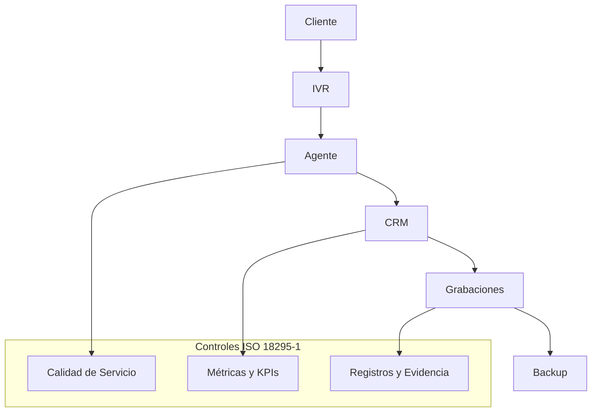

# ISO 18295-1 — Implementación para Call Center

## Objetivo
ISO 18295-1 establece los requisitos de calidad y operación para centros de contacto, asegurando servicio consistente, confiable y medible.

---

## Diagrama de operación del Call Center

---

## Por qué es necesaria

| Aspecto | Sin ISO 18295 | Con ISO 18295 |
|--------|-------------|--------------|
Experiencia cliente | Inconsistente | Estable |
Evidencia legal | Débil | Fuerte |
Control operativo | Bajo | Alto |
Imagen institucional | Dañada | Profesional |

---

## Desarrollo tecnológico alineado

### Software

| Área | Tecnología |
|-----|-----------|
Telefonía | Asterisk, FreePBX |
Gestión clientes | CRM |
Tickets | ITSM |
Monitoreo | Grafana |

### Hardware

| Área | Equipo |
|-----|--------|
PBX | Servidor dedicado |
Grabaciones | Storage dedicado |
Backups | Backup server |
Red | QoS en Core |

---

## Por qué cumplir el estándar sin certificarse

- Mejora servicio y reputación
- Reduce conflictos legales
- Aumenta confianza de clientes

---

