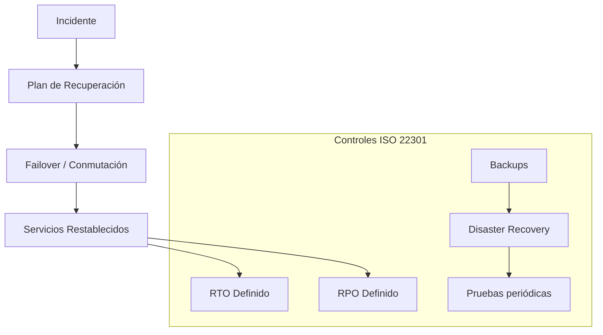

# ISO 22301 — Implementación de Continuidad del Negocio

## Objetivo
ISO 22301 define cómo garantizar que los servicios críticos sigan operando ante incidentes: apagones, fallos de red, ataques, desastres físicos o errores humanos.

Esta norma asegura **resiliencia operativa**.

---

## Diagrama de continuidad dentro de la arquitectura

---

## Por qué es necesaria

| Problema | Sin ISO 22301 | Con ISO 22301 |
|---------|-------------|-------------|
Caídas prolongadas | Crítico | Recuperación controlada |
Pérdida de datos | Alta | Limitada |
Impacto legal | Alto | Mitigado |
Continuidad del servicio | Inestable | Garantizada |

---

## Desarrollo tecnológico alineado

### Software

| Área | Tecnología |
|-----|-----------|
Gestión de continuidad | ITSM / Confluence |
Backups | Veeam, Restic, Borg |
Monitoreo | Prometheus, Grafana |
Orquestación | Proxmox / Kubernetes |

### Hardware

| Área | Equipo |
|-----|--------|
Continuidad eléctrica | UPS Online + Generador |
Cómputo | Cluster x86 |
Almacenamiento | Storage primario + DR |
Red | Enlaces redundantes |

---

## Por qué cumplir el estándar sin certificarse

- Reduce riesgos financieros y operativos
- Garantiza cumplimiento contractual
- Facilita auditorías
- Da ventaja competitiva frente a otros proveedores

---

## Próximo documento
Implementación de **ISO 18295-1 — Contact Center**.
