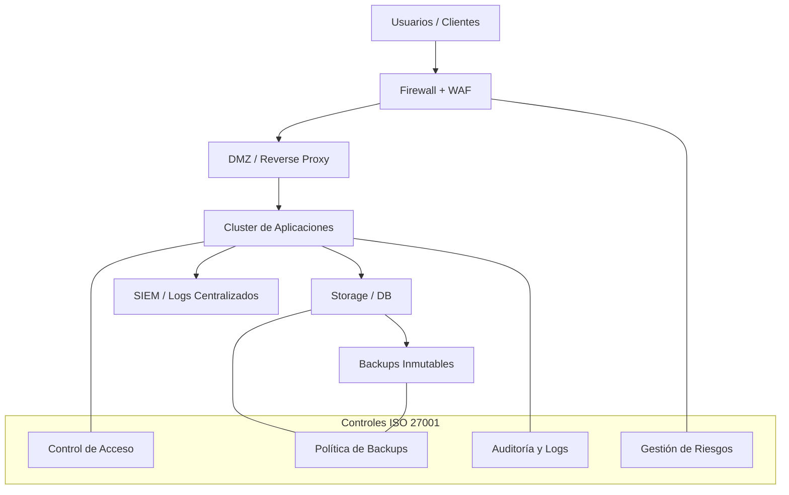

# ISO/IEC 27001 — Implementación en la Arquitectura ISP + Hosting

## Objetivo
ISO/IEC 27001 establece un Sistema de Gestión de Seguridad de la Información (ISMS) para proteger **confidencialidad, integridad y disponibilidad** de la información.

**Nota clave:**  
La certificación **no es obligatoria** para operar, pero **sí es crítico mantener los estándares** para reducir riesgos legales, técnicos y operativos.

---

## Diagrama de implementación en la arquitectura

---

## Por qué es necesaria ISO 27001 en este proyecto

| Riesgo | Sin ISO | Con ISO |
|------|------|------|
Pérdida de datos | Crítica | Controlada |
Incidentes legales | Alta exposición | Evidencia y defensa |
Ataques | Respuesta reactiva | Respuesta planificada |
Confianza clientes | Baja | Alta |

---

## Desarrollo tecnológico alineado a ISO 27001

### Software

| Área | Tecnología |
|---|---|
Control de accesos | Keycloak, LDAP, MFA |
Auditoría y logs | Loki, ELK, Wazuh |
Backups | Veeam, Borg, Restic |
Gestión de riesgos | OpenRMF, Excel/Docs |
CI/CD seguro | GitHub Actions, SonarQube |

### Hardware

| Área | Equipo |
|---|---|
Perímetro | Firewall UTM |
Cómputo | Servidores x86 en cluster |
Almacenamiento | Storage NVMe + ROSE |
Respaldo | Backup server dedicado |
Continuidad | UPS Online + Generador |

---

## Por qué mantener el estándar aunque no se pague certificación

- Protege la información crítica del gobierno y clientes.
- Reduce pérdidas por fallos y ciberataques.
- Facilita contratos con entidades públicas.
- Aporta estructura de crecimiento y control.

