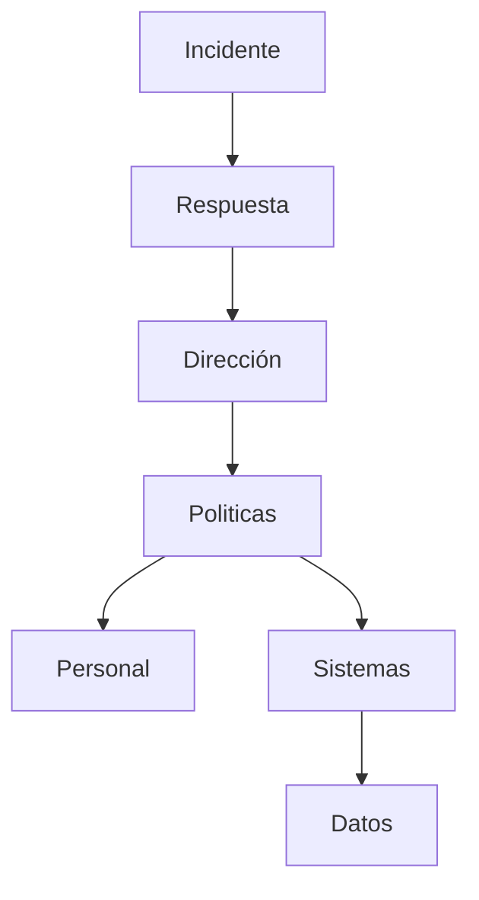

# 🔐 Políticas de Seguridad
## Guía de formalización para ISP + Hosting

---

## 🎯 Objetivo

Definir y documentar las reglas que protegen:
- la información,
- los sistemas,
- la operación del negocio,
- y la responsabilidad legal de las partes.

Las políticas convierten la infraestructura en un **sistema controlado y defendible**.

---

## 🧱 ¿Qué son las políticas de seguridad?

Son documentos formales que indican:
- **qué se permite**
- **qué no se permite**
- **quién es responsable**
- **qué sucede si hay un incidente**

---

## 🧩 Diagrama de gobierno de seguridad

---

## 🛡️ Políticas mínimas requeridas

### 📂 Política de Control de Acceso
- Roles y permisos
- MFA obligatorio
- Principio de mínimo privilegio

### 💾 Política de Respaldo y Recuperación
- Backups 3-2-1
- Pruebas de restauración
- Retención de datos

### 🌐 Política de Uso Aceptable
- Uso de sistemas y red
- Prohibiciones
- Sanciones

### 🧾 Política de Registro y Auditoría
- Logging centralizado
- Retención mínima
- Protección de evidencias

### 🧯 Política de Gestión de Incidentes
- Clasificación de incidentes
- Escalamiento
- Comunicación con clientes

### ⚙️ Política de Gestión de Cambios
- CI/CD
- Autorizaciones
- Ventanas de mantenimiento

---

## 🛠️ Cómo se implementa

### Lado del especialista (proveedor)

- Diseña políticas
- Configura sistemas para cumplirlas
- Implementa monitoreo
- Capacita personal
- Audita cumplimiento

### Lado del cliente

- Aprueba políticas
- Aplica sanciones
- Proporciona recursos
- Participa en revisiones

---

## ⚖️ Justificación

| Sin políticas | Con políticas |
|-------------|-------------|
Riesgo legal | Control legal |
Caos operativo | Operación ordenada |
Pérdida de datos | Protección sistemática |
Fallas ocultas | Detección temprana |

---

## 🏁 Conclusión

Las políticas son el cimiento invisible del negocio.
Sin ellas, ninguna arquitectura es confiable.

