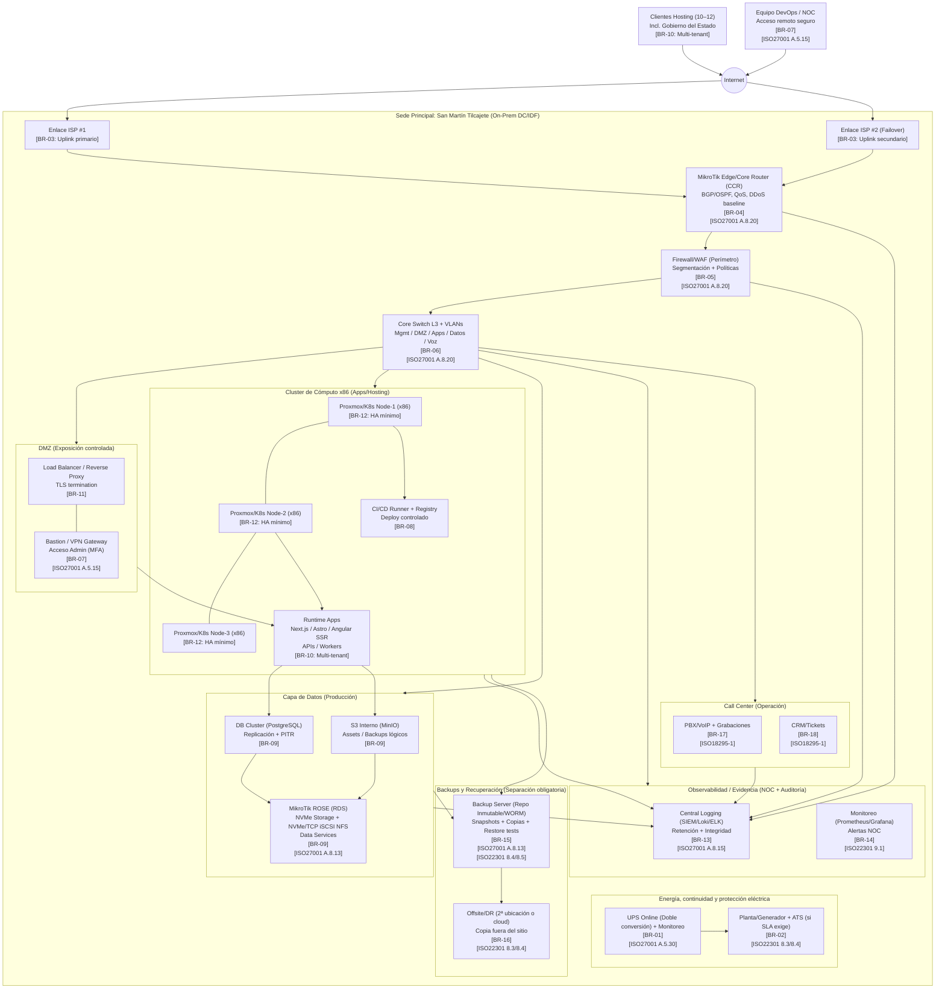

# 🏗️ Arquitectura Técnica
## Plataforma ISP + Hosting Estatal
**Ubicación principal:** San Martín Tilcajete  
**Horizonte:** 10–12 clientes en 12 meses 

---

## 🎯 Objetivo del sistema

Diseñar una infraestructura **estable, escalable y legalmente protegida** para:

- Operar como **proveedor de conectividad (ISP)**
- Ofrecer **hosting profesional de aplicaciones**
- Garantizar **continuidad ante apagones**
- Cumplir estándares de operación para **call center** y manejo de datos sensibles

---

## 🗺️ Mapa General de Arquitectura

---

## 🧾 Marco Normativo (ISO)

### ISO/IEC 27001:2022  [ver documentacion de ISO ](ISO27001_Implementacion.md)
- **A.5.15** Control de acceso
- **A.8.13** Respaldos de información
- **A.8.15** Registros y monitoreo
- **A.8.20** Seguridad de red

### ISO 22301:2019 [ver documentacion de ISO ](ISO22301_Implementacion.md)
- **8.3 – 8.5** Continuidad del negocio

### ISO 18295-1:2017 [ver documentacion de ISO ](ISO18295_Implementacion.md)
- Operación de centros de contacto

---

## 🧱 Componentes físicos requeridos

### Red y seguridad

| Equipo | Cantidad | Motivo | Precio MXN aprox |
|------|------|------|------|
| MikroTik CCR2116 | 1 | Core de red ISP | $18,000 – $21,000 |
| FortiGate 100F (Firewall empresarial) | 1 | Protección perimetral | $35,000 – $60,000 |
| Switch L3 10G | 1 | Segmentación de red | $9,000 – $12,000 |

### Energía

| Equipo | Cantidad | Motivo | Precio MXN |
|------|------|------|------|
| UPS Online 3000VA | 1–2 | Continuidad eléctrica | ~$53,000 |
| Generador + ATS | opcional | Continuidad extendida | $80,000+ |

### Cómputo

| Equipo | Cantidad | Motivo | Precio MXN |
|------|------|------|------|
| Servidor x86 rack | 3 | Cluster de aplicaciones | ~$110,000 c/u |
| NIC 10G | 3 | Alto rendimiento | $3,000 c/u |

### Almacenamiento y datos

| Equipo | Cantidad | Motivo | Precio MXN |
|------|------|------|------|
| MikroTik ROSE | 1 | Servicios de datos NVMe | ~$36,000 |
| NVMe enterprise | 6–12 | Bases y objetos | $6,000 – $12,000 c/u |

### Backups

| Equipo | Cantidad | Motivo | Precio MXN |
|------|------|------|------|
| Backup Server | 1 | Repositorio inmutable | $60,000+ |
| Offsite Backup | 1 | Recuperación ante desastre | variable |

---

## 🧭 Justificación de arquitectura

- La red, cómputo y datos están **separados** para evitar fallas en cascada.
- El cluster x86 permite crecimiento sin rediseñar el sistema.
- ROSE se usa como **capa de datos**, no como servidor principal de apps.
- Backups y DR reducen exposición legal y operativa.
- Cumple prácticas exigidas por **ISO 27001 / 22301 / 18295**.

---

##  Reglas de negocio clave

| Código | Regla |
|------|------|
| BR-01 | Ningún sistema crítico puede apagarse abruptamente |
| BR-03 | Enlaces de red redundantes |
| BR-08 | Todo despliegue pasa por CI/CD |
| BR-12 | Cluster mínimo de 3 nodos |
| BR-15 | Backups 3-2-1 obligatorios |
| BR-17 | Pruebas periódicas de restauración |

---

##  Revisar

1. [Ver documento : Definir RTO / RPO por servicio](RTO_RPO.md)  
2. [Ver docuemnto : Clasificar datos críticos](Clasificacion_Datos_Criticos.md)  
3. [Ver documento : Establecer SLAs por cliente](SLA_Guia_Implementacion.md)  
4. [Ver documento: Políticas de Seguridad](Politicas_Seguridad_Guia.md)
