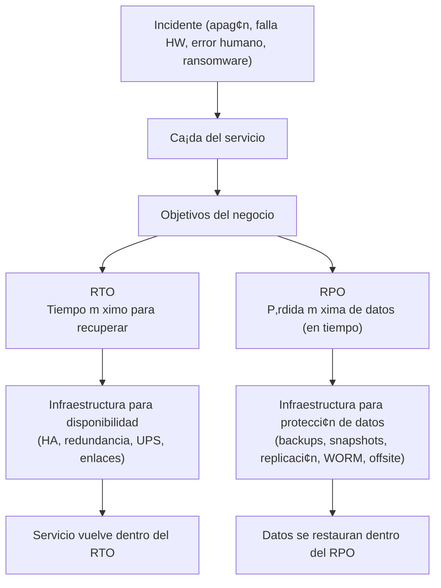
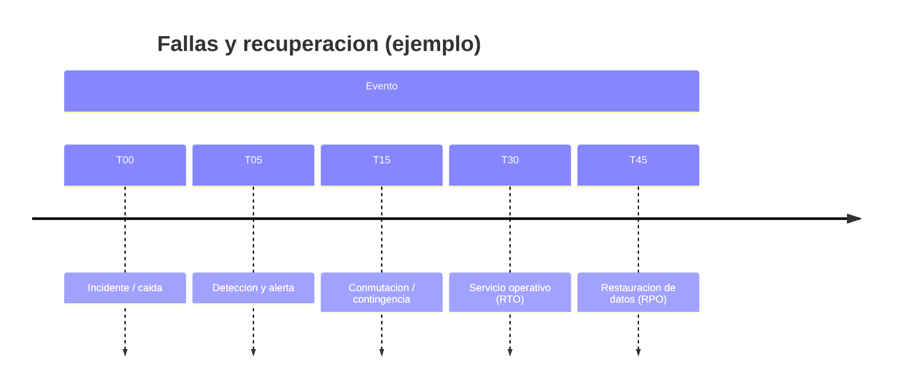

# RTO y RPO (explicación para cliente)
## Cómo definen la infraestructura (ISP + Hosting + Call Center)

**RTO (Recovery Time Objective):** tiempo máximo permitido para **recuperar el servicio** después de una falla.  
**RPO (Recovery Point Objective):** cantidad máxima de **datos que se pueden perder** medida en tiempo (hasta qué punto “regresas” al restaurar).

---

## Resumen ejecutivo (en una frase)

- **RTO = “¿Cuánto tiempo puedo estar caído?”**  
- **RPO = “¿Cuánta información puedo perder?”**

---

## Diagrama conceptual

---

## Línea de tiempo: cómo se ven RTO y RPO

> **Interpretación:**  
> Si el **RTO** es 30 minutos, el servicio debe estar de vuelta **antes de 00:30**.  
> Si el **RPO** es 15 minutos, como máximo se acepta perder hasta **los últimos 15 min** de datos.

---

## Ejemplos por tipo de servicio (recomendación inicial)

| Servicio | RTO sugerido | RPO sugerido | Comentario |
|---|---:|---:|---|
| Call Center (voz + tickets) | 15–30 min | 5–15 min | Prioridad operativa; caída impacta atención y evidencia |
| Hosting de apps (Next/Astro/Angular SSR) | 30–60 min | 15–60 min | Depende del SLA con clientes |
| APIs críticas (gobierno/estado) | 30 min | 15 min | Ideal con replicación y backups frecuentes |
| Bases de datos principales | 15–30 min | 5–15 min | Requiere PITR y/o réplica |
| Sistemas internos no críticos | 4–8 h | 24 h | Menor costo, mayor tolerancia |

---

## Qué implica en la arquitectura (traducción a componentes)

### Para cumplir **RTO** (tiempo de recuperación)
- **UPS online** para evitar apagón abrupto y permitir apagado controlado
- **Redundancia de enlaces** (ISP #1 + ISP #2)
- **Cluster de cómputo (x86)** con alta disponibilidad (mínimo 3 nodos)
- Procedimientos y runbooks de recuperación (operación)

### Para cumplir **RPO** (pérdida de datos)
- **Backups 3-2-1** (3 copias, 2 medios, 1 offsite)
- **Snapshots** + retención
- **PITR** (Point-in-Time Recovery) para BD (ej. PostgreSQL)
- **Repositorio inmutable/WORM** (protege contra ransomware y borrado)
- **Pruebas periódicas de restauración** (sin pruebas, el backup no existe)

---

## Nota de cumplimiento (ISO) en lenguaje de negocio
- **ISO 22301 (continuidad):** obliga a definir objetivos de recuperación y preparar la organización para responder y recuperar ante incidentes.  
- **ISO 27001 (seguridad):** exige control de acceso, respaldos, y registros/auditoría para proteger y demostrar integridad de información.

---

## Preguntas rápidas para definirlos (en 5 minutos)
1) ¿Cuánto tiempo máximo puede estar caído el call center sin afectar operación? (RTO)  
2) ¿Cuántos minutos de datos de tickets/grabaciones serían “aceptables” perder? (RPO)  
3) ¿El gobierno exige SLA o auditoría específica?  
4) ¿Se requiere segunda sede (DR ) o basta offsite en cloud?
[ver documentacion de DR](DR_Disaster_Recovery.md)
---

**Resultado:** Con RTO/RPO definidos, se dimensiona con precisión la inversión en: energía, red, cluster, storage y backups.

