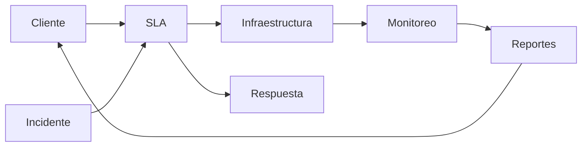

# 📜 SLA — Service Level Agreement
## Guía para cliente y proveedor (ISP + Hosting)

---

## 🧭 ¿Qué es un SLA?

Un **SLA (Service Level Agreement)** es un acuerdo formal que define:
- qué servicio se entrega,
- con qué nivel de calidad,
- en qué tiempos,
- y qué ocurre si no se cumple.

Es el contrato técnico que protege **al cliente y al proveedor**.

---

## 🧱 Componentes clave de un SLA

| Elemento | Significado |
|--------|------------|
Disponibilidad | % de tiempo en línea del servicio |
RTO | Tiempo máximo de recuperación |
RPO | Pérdida máxima de datos aceptable |
Soporte | Horarios, canales y tiempos de respuesta |
Penalizaciones | Compensaciones si no se cumple |
Responsabilidades | Qué hace el proveedor y qué hace el cliente |

---

## 🧩 Diagrama del funcionamiento del SLA

---

## 🛠️ ¿Cómo se implementa un SLA?

### 📌 Lado del proveedor (especialista)

1. Definir niveles de servicio:
   - uptime (ej. 99.9%)
   - RTO/RPO
   - ventanas de mantenimiento
2. Diseñar infraestructura para cumplirlos
3. Implementar monitoreo 24/7
4. Documentar procedimientos de respuesta
5. Medir y reportar resultados mensualmente

### 🧾 Lado del cliente

1. Definir qué servicios son críticos
2. Aceptar tiempos de recuperación realistas
3. Definir impacto del negocio por caídas
4. Firmar compromisos de responsabilidad compartida

---

## 🧮 Ejemplo de niveles de SLA

| Servicio | Uptime | RTO | RPO |
|---------|-------|-----|-----|
Hosting web | 99.9% | 60 min | 30 min |
APIs gobierno | 99.95% | 30 min | 15 min |
Call center | 99.9% | 15 min | 10 min |

---

## ⚖️ ¿Por qué es necesario?

- Reduce conflictos contractuales
- Establece expectativas claras
- Justifica inversión en infraestructura
- Protege legalmente al proveedor
- Permite crecimiento ordenado

---

## 🧠 Recomendación ejecutiva

> Sin SLA no existe servicio profesional.
> Con SLA el negocio se vuelve escalable y defendible.

---

## 🏁 Conclusión

El SLA es el puente entre la tecnología y el negocio.
Sin él, toda la arquitectura carece de dirección.

